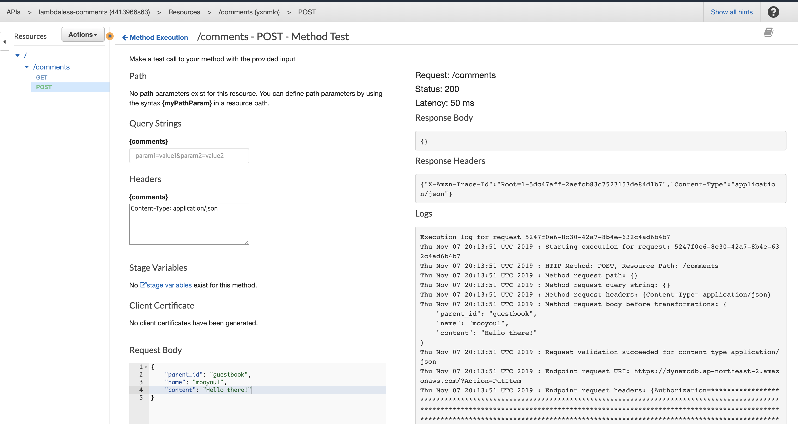

# @lambdaless/comment

An AWS CDK construct of Lambdaless comment service.

### Why?

Just for fun 🥳 

### How?

Just use AWS Service integration with API Gateway built-ins (Request Validation, Request Template...)

### Getting Started

Install `@lambdaless/comment` construct package from NPM:

```bash
$ npm i @lambdaless/comment --save
```

Add service construct to your AWS CDK based Stack:

```typescript
import * as cdk from "@aws-cdk/core";

import * as apigw from "@aws-cdk/aws-apigateway";
import { CommentService } from "@lambdaless/comment";

export class MyStack extends cdk.Stack {
  public constructor(scope: cdk.App, id: string, props?: cdk.StackProps) {
    super(scope, id, props);

    // Create or reference pre-existing API Gateway RestAPI
    const api = new apigw.RestApi(this, "API", {
      restApiName: "my-awesome-apigw",
      endpointTypes: [apigw.EndpointType.EDGE],
      deployOptions: {
        loggingLevel: apigw.MethodLoggingLevel.INFO,
      },
    });

    // Create Email Subscription Service and Attach API to given API Gateway RestAPI target
    const emailSubscriptionService = new EmailSubscriptionService(this, "EmailSubscriptionService", {
      api,
      resource: api.root.addResource("subscriptions"),
      tableName: "lambdaless-email-subscriptions",
    });
  }
}
```

and then, Deploy your CDK App. Done! 🎉


### API

Current implementation has two APIs - createComment and listComments.

#### createComment

POST /base_path/comments

Create a new comment.

##### Request Parameters

N/A

##### Request Body

Content-Type: application/json

```json
{
  "title": "createCommentRequestBody",
  "type": "object",
  "required": ["parent_id", "name", "content"],
  "properties": {
    "parent_id": {
        "type": "string",
        "minLength": 1,
        "maxLength": 256
    },
    "name": {
        "type": "string",
        "minLength": 1,
        "maxLength": 64
    },
    "content": {
        "type": "string",
        "minLength": 1,
        "maxLength": 2048
    }
  }
}
```

For example:

```json
{
  "parent_id": "/posts/12345",
  "name": "mooyoul",
  "content": "Hello there!"
}
```


##### Responses

| Status | Description |
| ------ | ----------- |
| 200 | Successfully created comment. Empty response body will be provided. |
| 400 | Validation Error. Specified query parameter does not exists, or request body does not match to schema. |
| 422 | Failed to create comment due to DynamoDB Error. |
| 500 | API Gateway Internal Error. 


#### listComments

GET /base_path/comments

List comments


##### Request Parameters

| location | name | type | required | description |
| -------- | ---- | ---- | -------- | ----------- |
| query | parent_id | string | yes | Parent Identifier of given comment. THis is a kind of topic, or category. You can use this field to separate comments. |
| query | sort_by | `oldest` / `latest` | no | The option to sort results. If `oldest` is used, Ascending order of comments will be returned. If `latest` is used, descending order of comments will be returned. Otherwise `oldest` will be used as default value. |
| query | count | integer | no | Pagination size |
| query | after | string | no | Pagination key (cursor) |     
 

##### Responses

| Status | Description |
| ------ | ----------- |
| 200 | Successfully fetched comment. |
| 400 | Validation Error. Specified query parameter does not exists, or request body does not match to schema. |
| 422 | Failed to create comment due to DynamoDB Error. |
| 500 | API Gateway Internal Error. 


###### Response Schema

```json
{
  "title": "listCommentsResponseBody",
  "type": "object",
  "required": ["parent_id", "name", "content"],
  "properties": {
    "data": {
      "type": "object",
      "required": ["id", "content", "created_at"],
      "properties": {
        "id": {
          "type": "string"
        },
        "content": {
          "type": "string"
        },
        "created_at": {
          "type": "number"
        }
      }
    },
    "paging": {
      "type": "object",
      "properties": {
        "after": {
          "type": "string"
        }
      }
    }
  }
}
```

### Testing

Since there are no any business logic, Testing is not necessary.


### Debugging



Use API Gateway built-in API Tester. You can inspect full request/response and execution logs.

See: https://docs.aws.amazon.com/apigateway/latest/developerguide/how-to-test-method.html

