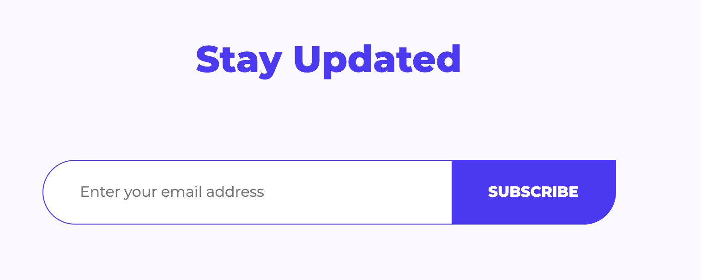
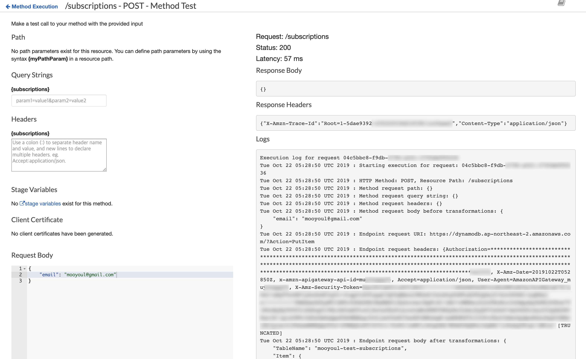

# @lambdaless/email-subscription

An AWS CDK construct of Lambdaless Email subscription service.  

### Why?

You may need to create "Email Subscribe" feature, especially your product is in early stage. You'll build an promotion website.

Usually, we have to build API to register email subscriptions. Like this:


 
Previously, We had simple lambda function that stores email subscription. 

For example: 

```typescript
import { Decorator, Query, Table } from "dynamo-types";
import * as Joi from "joi";

const RequestModelSchema = Joi.object({
  email: Joi.string().email().required(),
}).required();

@Decorator.Table({ name: "my_promotion_subscriptions" })
class Subscription extends Table {
  @Decorator.HashPrimaryKey("email")
  public static readonly primaryKey: Query.HashPrimaryKey<Subscription, string>;
                                                                    
  @Decorator.Writer()    
  public static readonly writer: Query.Writer<Subscription>;

  // Query Helpers
  public static create(email: string) {
    const model = new this();
    model.email = email;
    model.createdAt = Date.now();

    return model;
  }

  @Decorator.Attribute({ name: "e" })                              
  public email: string;
                                                                    
  @Decorator.Attribute({ name: "ca" })
  public createdAt: number;
}

export async function handler(event: Event) {
  // Validate Request
  const { error, value } = RequestModelSchema.validate(event.body);

  if (error) {
    return {
      statusCode: 422,
      headers: {
        "Content-Type": "application/json",      
      },
      body: JSON.stringify({
        error: { code: "INVALID_PARAMETER", message: error.message },
      }),
    }; 
  }
  
  // Store subscription data
  const subscription = Subscription.create(value.email);
  await subscription.save();
 
  return { 
    statusCode: 200,
    headers: {
        "Content-Type": "application/json",      
    },
    body: JSON.stringify({ data: { ok: true } }),
  };
}
```

It worked pretty good, but Lambda based API implementation has some downsides:

- We have to monitor Lambda invocations, latencies, failures ...
- We have to pay for Lambda Cost - Lambda just do simple tasks (Validate request, Write DynamoDB item...)
- We have to maintenance Lambda function and dependencies - Node.js Lambda runtime reaches EOL, New version of AWS SDK is released ...   

So we decided to remove Lambda usage in this use-case, and We could make this better!

### How?

Just use AWS Service integration with API Gateway built-ins (Request Validation, Request Template...) 

### Getting Started

Install `@lambdaless/email-subscription` construct package from NPM:

```bash
$ npm i @lambdaless/email-subscription --save
```

Add service construct to your AWS CDK based Stack:

```typescript

import * as cdk from "@aws-cdk/core";

import * as apigw from "@aws-cdk/aws-apigateway";
import { EmailSubscriptionService } from "@lambdaless/email-subscription";

export class MyStack extends cdk.Stack {
  public constructor(scope: cdk.App, id: string, props?: cdk.StackProps) {
    super(scope, id, props);

    // Create or reference pre-existing API Gateway RestAPI
    const api = new apigw.RestApi(this, "API", {
      restApiName: "my-awesome-apigw",
      endpointTypes: [apigw.EndpointType.EDGE],
      deployOptions: {
        loggingLevel: apigw.MethodLoggingLevel.INFO,
      },
    });

    // Create Email Subscription Service and Attach API to given API Gateway RestAPI target
    const emailSubscriptionService = new EmailSubscriptionService(this, "EmailSubscriptionService", {
      api,
      resource: api.root.addResource("subscriptions"),
      tableName: "lambdaless-email-subscriptions",
    });
  }
}
```

and then, Deploy your CDK App. Done! 🎉


### API

Current implementation has only one API - createSubscription.

#### createSubscription

POST /base_path/subscriptions

Create a new email subscription.

##### Request Parameters

N/A

##### Request Body

Content-Type: application/json

```json
{
  "title": "createSubscriptionRequestBody",
  "type": "object",
  "required": ["email"],
  "properties": {
    "email": {
        "type": "string",
        "format": "email"
    }
  }
}
```

For example:

```json
{
  "email": "mooyoul@example.com"
}
```


##### Responses

| Status | Description |
| ------ | ----------- |
| 200 | Successfully created a new subscription. Empty response body will be provided. |
| 400 | Validation Error. Specified query parameter does not exists, or request body does not match to schema. |
| 422 | Failed to create comment due to DynamoDB Error. This will be happen if given email address already exists in subscription list. |
| 500 | API Gateway Internal Error. 


### Testing

Since there are no any business logic, Testing is not necessary.


### Debugging



Use API Gateway built-in API Tester. You can inspect full request/response and execution logs.

See: https://docs.aws.amazon.com/apigateway/latest/developerguide/how-to-test-method.html


### Troubleshoot

##### Deploy failure with CloudWatch Logs Role message


> CloudWatch Logs role ARN must be set in account settings to enable logging.

In this case, You should configure IAM Role for logging.

Follow below two steps in [this document](https://aws.amazon.com/premiumsupport/knowledge-center/api-gateway-cloudwatch-logs/):

- "Create an IAM role for logging to CloudWatch" section
- "Add the IAM role in the API Gateway console"

> NOTE: "Enable logging for your API and stage" section is not required.

