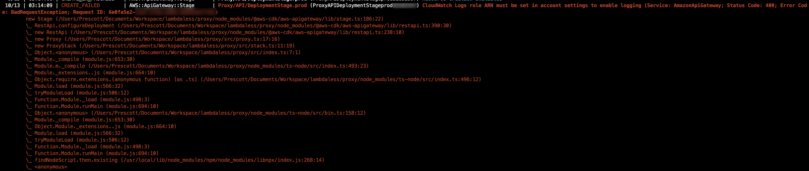

# Lambdaless Examples

A Full AWS CDK Application to demonstrate Lambdaless constructs.

### Getting Started

> If you're AWS CDK newbie. Please try [AWS CDK Workshop](https://cdkworkshop.com/) before continuing.

First, Clone this repository:

```bash
$ git clone https://gihub.com/mooyoul/lambdaless.git
```

Navigate to example directory:

```bash
$ cd lambdaless/example
```

Install required dependencies:

```bash
$ npm ci
```

Edit stack. You should change resource names which is globally unique (e.g. Name of S3 Bucket) 

```bash
$ vi src/api.ts
```

and then, Deploy your CDK App. 

```bash
$ npm run cdk -- deploy
```

Done! 🎉


### Troubleshoot

##### Deploy failure with CloudWatch Logs Role message



> CloudWatch Logs role ARN must be set in account settings to enable logging.

In this case, You should configure IAM Role for logging.

Follow below two steps in [this document](https://aws.amazon.com/premiumsupport/knowledge-center/api-gateway-cloudwatch-logs/):

- "Create an IAM role for logging to CloudWatch" section
- "Add the IAM role in the API Gateway console"

> NOTE: "Enable logging for your API and stage" section is not required.

