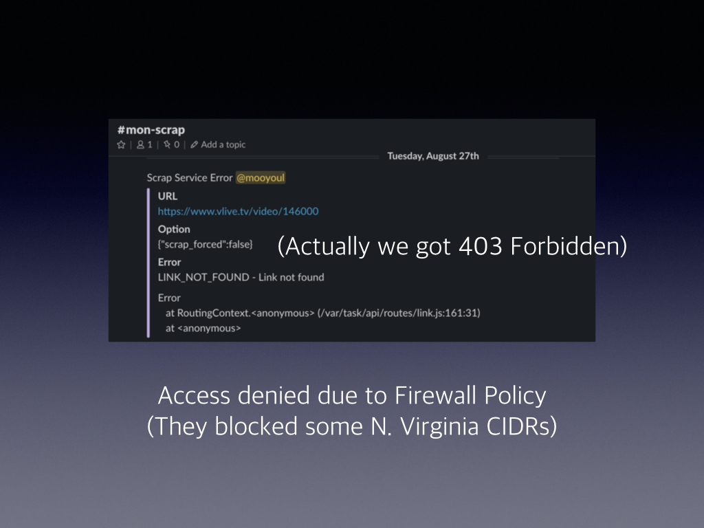
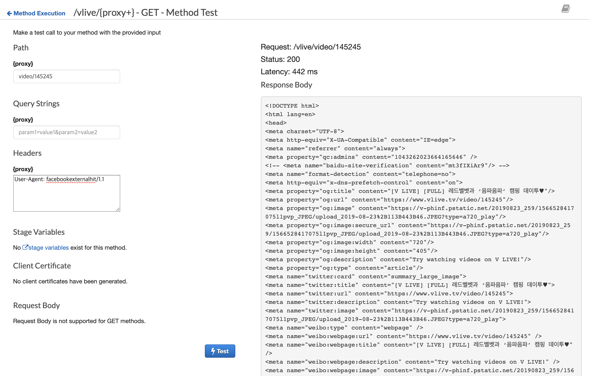
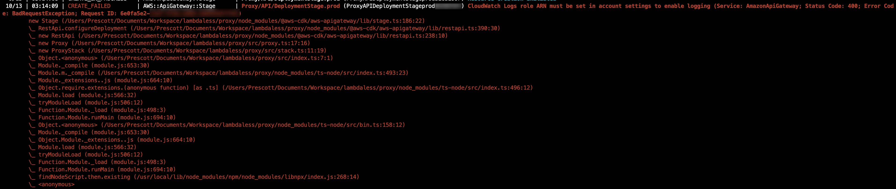

# Lambdaless Proxy

A HTTP Proxy implemented without Lambda usage

### Why?

You may need to proxy requests, due to following reasons:

- Blocked Access (e.g. Blocked Source IP, Blocked Source CIDR ...)
- Accelerate server access (e.g. Make open graph crawler to faster)
- Secure insecure resources (e.g. Prevent [Mixed Content](https://developers.google.com/web/fundamentals/security/prevent-mixed-content/what-is-mixed-content?hl=en) issue) 
 
 
 

At [Vingle](https://www.vingle.net), We have to proxy certain open graph scrap requests to bypass geo restrictions of some websites.

Previously, We had simple lambda function that proxies requests. 

For example: 

```typescript
import axios from "axios";

export async function handler(event: Event) {
  const { url } = event.body;
 
  const response = await axios({
    method: "GET",
    url,
    headers: {
      "User-Agent": "facebookexternalhit/1.1"
    },
    timeout: 15,
  });

  return { 
    statusCode: response.status,
    headers: response.headers,
    body: res.data,
  };
}
```

It worked pretty good, but Lambda based proxy has some downsides:

- We have to monitor Lambda invocations, latencies, failures ...
- We have to pay for Lambda Cost - Most time of lambda invocation just waits for response from upstream
- We have to maintenance Lambda function and dependencies - Node.js Lambda runtime reaches EOL, New version of axios is released ...   

So we decided to remove Lambda usage in this use-case, and We could make this better!

### How?

Just use HTTP_PROXY integration with pass-through option and abstract proxy endpoints by using AWS CDK. 


### Getting Started

Clone lambdaless repository:

```bash
$ git clone https://github.com/mooyoul/lambdaless.git
```

Navigate to `proxy` directory:

```bash
$ cd lambdaless/proxy
```

Install required dependencies:

```bash
$ npm ci
``` 

Edit proxy configurations:

```bash
$ vi src/index.ts
```

5. Deploy

```bash
$ npm run cdk -- deploy
$ # OR
$ env AWS_PROFILE=myprofile AWS_REGION=us-east-1 npm run cdk -- deploy
```

### Example

```typescript
const proxy = new Proxy(this, "Proxy", {
  apiName: "lambdaless-proxy",
  endpointType: EndpointType.EDGE,
});

proxy.addProxy("ipify", "https://api.ipify.org", "GET");
```

This will create one resource that proxies `/ipify` path to `https://api.ipify.org

Example matches:

| Endpoint | Mapped to |
| -------- | --------- |
| https://API_ID.execute-api.REGION.amazonaws.com/prod/ipify | https://api.ipify.org/ |
| https://API_ID.execute-api.REGION.amazonaws.com/prod/ipify/foo/bar?baz | https://api.ipify.org/foo/bar?baz |


### Testing

Since there are no any business logic, Testing is not necessary.


### Debugging



Use API Gateway built-in API Tester. You can inspect full request/response and execution logs.

See: https://docs.aws.amazon.com/apigateway/latest/developerguide/how-to-test-method.html


### Troubleshoot

##### Deploy failure with CloudWatch Logs Role message



> CloudWatch Logs role ARN must be set in account settings to enable logging.

In this case, You should configure IAM Role for logging.

Follow below two steps in Guide

- "Create an IAM role for logging to CloudWatch" section
- "Add the IAM role in the API Gateway console"

> NOTE: "Enable logging for your API and stage" section is not required.


### Challenges / Wishlists

##### "Dynamic" forward proxy

It would be nice if we can implement forward proxy

For example, 

- https://API_ID.execute-api.REGION.amazonaws.com/prod/https://www.example.com/foo/bar/baz

will proxy requests to

- https://www.example.com/foo/bar/baz

I haven't tried this so let me know it can be implemented in Lambdaless, 
or you can try my alternative project: [proxyfront](https://github.com/mooyoul/proxyfront) - Another approach to implement forward proxy using Lambda@Edge.
