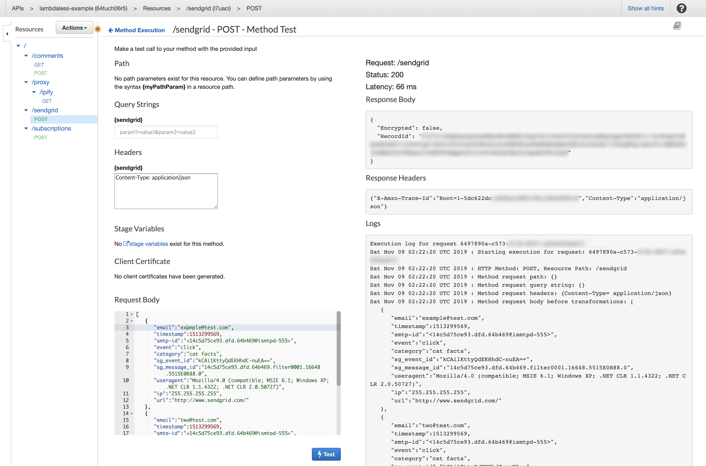

# @lambdaless/sendgrid-event-collector

An AWS CDK construct of SendGrid Event Collector.

### Why?

SendGrid has Event Tracking features, and one of them is Webhook based Event delivery.

At Vingle, We heavily rely on Kinesis Streams and Kinesis Firehose to store massive event records.

Previously, We use Lambda function to transfer incoming events to Firehose. 

Lambda runtime only did these tasks:
1. Parse JSON Body
2. Map each records to JSON encoded string
3. Join each mapped records with `\n` character
4. Call AWS SDK to send joined string to Kinesis Firehose Delivery Stream.

Summarized Task / Responsibility is much more simpler:
1. Map Request Payload to Firehose Record
2. Call PutRecord API of Kinesis Firehose service.


### How?

Just use AWS Service integration with API Gateway built-ins (Request Validation, Request Template...)

### Getting Started

Install `@lambdaless/sendgrid-event-collector` construct package from NPM:

```bash
$ npm i @lambdaless/sendgrid-event-collector --save
```

Add service construct to your AWS CDK based Stack:

```typescript
import * as cdk from "@aws-cdk/core";

import * as apigw from "@aws-cdk/aws-apigateway";
import * as iam from "@aws-cdk/aws-iam"; // only required for collector demo
import * as firehose from "@aws-cdk/aws-kinesisfirehose"; // only required for collector demo
import * as s3 from "@aws-cdk/aws-s3"; // only required for collector demo

import { SendgridEventCollector } from "@lambdaless/sendgrid-event-collector"; 

export class MyStack extends cdk.Stack {
  public constructor(scope: cdk.App, id: string, props?: cdk.StackProps) {
    super(scope, id, props);

    // Create or reference pre-existing API Gateway RestAPI
    const api = new apigw.RestApi(this, "API", {
      restApiName: "my-awesome-apigw",
      endpointTypes: [apigw.EndpointType.EDGE],
      deployOptions: {
        loggingLevel: apigw.MethodLoggingLevel.INFO,
      },
    });

    /**
     * Additional base resources for Webhook event collectors
     */
    // A bucket to store Firehose buffered records
    const collectorBucket = new s3.Bucket(this, "CollectorBucket", {
      bucketName: "lambdaless-collector-example",
    });

    // An IAM Role to allow S3 Access from Firehose
    const sendgridDeliveryStreamRole = new iam.Role(this, "SendgridDeliveryStreamRole", {
      assumedBy: new iam.ServicePrincipal("firehose.amazonaws.com"),
      externalIds: [cdk.Aws.ACCOUNT_ID],
      inlinePolicies: {
        "allow-firehose-access": new iam.PolicyDocument({
          statements: [new iam.PolicyStatement({
            actions: [
              "s3:AbortMultipartUpload",
              "s3:GetBucketLocation",
              "s3:GetObject",
              "s3:ListBucket",
              "s3:ListBucketMultipartUploads",
              "s3:PutObject"
            ],
            effect: iam.Effect.ALLOW,
            resources: [
              collectorBucket.bucketArn,
              `${collectorBucket.bucketArn}/*`,
            ],
          })],
        }),
      }
    });
    // Create a Firehose Delivery Stream
    const sendgridDeliveryStream = new firehose.CfnDeliveryStream(this, "SendgridEventDeliveryStream", {
      deliveryStreamName: "lambdaless-sendgrid-events",
      deliveryStreamType: "DirectPut",
      s3DestinationConfiguration: {
        bucketArn: collectorBucket.bucketArn,
        bufferingHints: {
          // intervalInSeconds: cdk.Duration.minutes(5).toSeconds(),
          // sizeInMBs: 10,
          intervalInSeconds: cdk.Duration.seconds(60).toSeconds(),
          sizeInMBs: 1,
        },
        // compressionFormat: "GZIP",
        compressionFormat: "UNCOMPRESSED",
        roleArn: sendgridDeliveryStreamRole.roleArn,
      },
    });

    // Create Sendgrid Event Collector and Attach API to given API Gateway RestAPI target
    const sendgridEventCollector = new SendgridEventCollector(this, "SendgridEventCollector", {
      api,
      resource: api.root.addResource("sendgrid"),
      deliveryStream: sendgridDeliveryStream,
    });
  }
}
```

and then, Deploy your CDK App. Done! 🎉


### API

Current implementation has only one API - collectSendgridEvent API

#### collectSendgridEvent

POST /base_path/sendgrid

Webhook Endpoint for collecting Sendgrid events to S3 Bucket via Kinesis Firehose.

##### Request Parameters / Request Body

Please refer to official documents:
- [Getting started with the Event Webhook](https://sendgrid.com/docs/for-developers/tracking-events/getting-started-event-webhook/)
- [Event Webhook Reference](https://sendgrid.com/docs/for-developers/tracking-events/event/#engagement-events) 

##### Responses

Response body is pass-through. For detailed response body specification, Please refer to [Kinesis Firehose API Reference](https://docs.aws.amazon.com/firehose/latest/APIReference/API_PutRecord.html#API_PutRecord_ResponseSyntax) 

| Status | Description |
| ------ | ----------- |
| 200 | Successfully buffered events to Kinesis Firehose. |
| 400 | Validation Error. Specified query parameter does not exists, or request body does not match to schema. |
| 422 | Failed to buffer events to Kinesis Firehose. |
| 500 | API Gateway Internal Error, or [Kinesis Firehose Error](https://docs.aws.amazon.com/firehose/latest/APIReference/API_PutRecord.html#API_PutRecord_Errors). | 


### Testing

Since there are no any business logic, Testing is not necessary.


### Debugging



Use API Gateway built-in API Tester. You can inspect full request/response and execution logs.

See: https://docs.aws.amazon.com/apigateway/latest/developerguide/how-to-test-method.html

